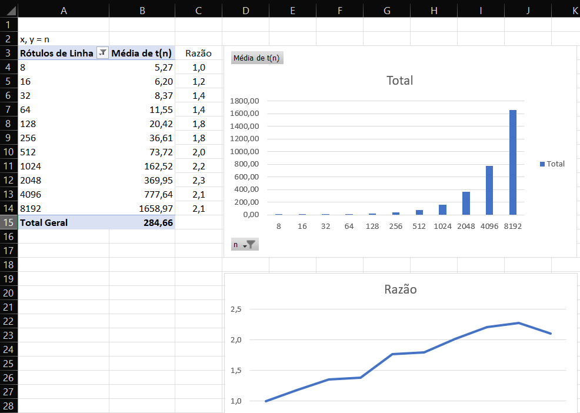
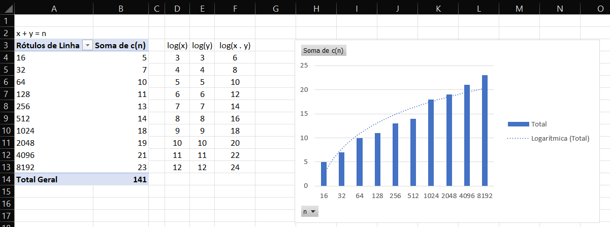

# EP01

## Bibiliotecas

```bash
pip install -r requirements.txt
```

## Executando

### Programa

```bash
python k_esimo_menor.py
```

### Todos os testes

```bash
python -m pytest -s --hypothesis-show-statistics
```

## Coleta de dados

### Contagem número execuções

```bash
# Descomentar linha 27 k_esimo_menor.py (print)
# Comentar linhas 29 e 55 test_k_esimo_menor.py (print)
python -m pytest -s > result_count.txt
```

### Testes e tomada de tempo dobrando entrada

```bash
# Comentar linha 26 k_esimo_menor.py (print)
# Descomentar linha 55 test_k_esimo_menor.py (print)
python -m pytest -s -k 'test_double_k_esimo_menor' > result2.txt
```

### Testes e tomada de tempo usando biblioteca hypothesis

```bash
# Comentar linha 26 k_esimo_menor.py (print)
# Descomentar linha 29 test_k_esimo_menor.py (print)
python -m pytest -s -k 'test_k_esimo_menor' > result.txt
```

## Resultados

Na planilha [Resultado algoritmo](result_algo.xlsx), nas abas:

- **t(n)** - tempo de execução do algoritmo para n elementos;
- **c(n)** - contagem do número de execuções para n elementos;
- **data** - dados da execução ([result2.txt](result2.txt), [result_count.txt](result_count.txt)).

### Tempo



### Contagem


