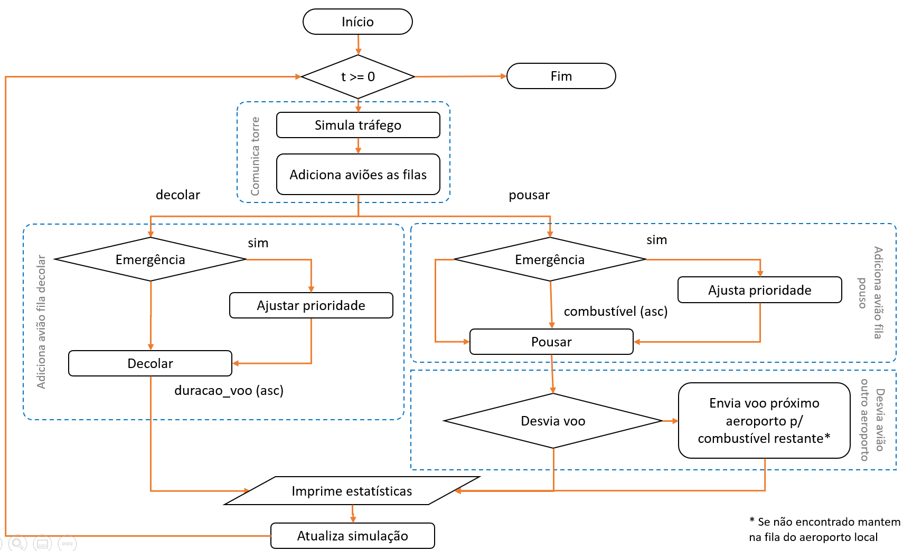
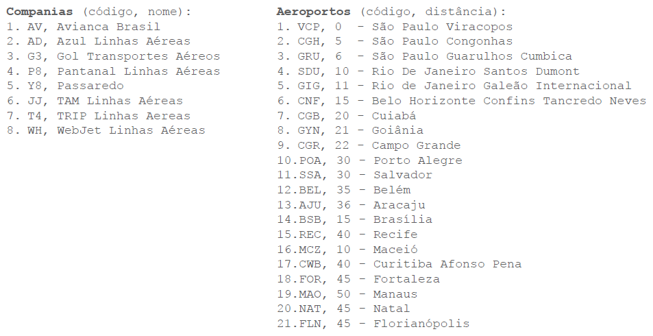
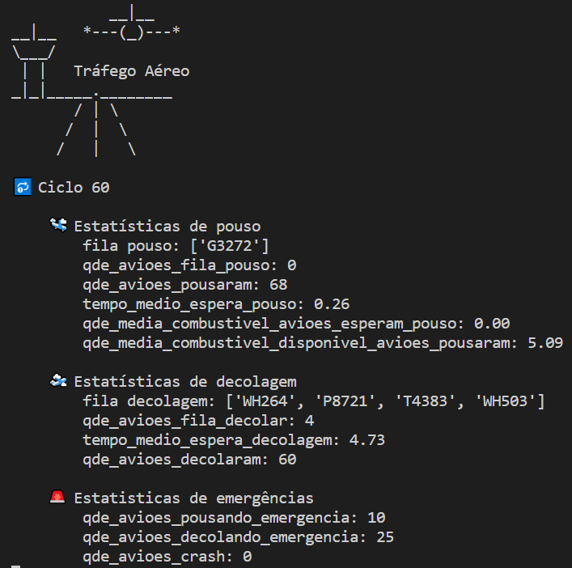

# Simulação aeroporto

## Fluxograma



## Dados



## Estado e fórmulas da simulação

- tempo_simulacao = [0..max_tempo_simulacao]
- fila_pouso = [0..n avioes intencao pousar]
- qde_avioes_fila_pouso = count(avioes na fila de pouso)
- qde_avioes_pousaram = count(avioes pousaram)
- total_tempo_avioes_esperaram_pouso = sum(tempo_simulacao - tempo simulacao qdo aviao entrou na fila)
- tempo_medio_espera_pouso: total_tempo_avioes_esperaram_pouso / qde_avioes_pousaram
- total_combustivel_avioes_esperam_pouso = sum(aviao.combustivel entra fila pouso) - sum(aviao.combustivel qdo pousa pista regular) - sum(aviao.combustivel desvia outro aeroporto) - sum(aviao.combustivel qdo pousa usando pista decolagem)
- qde_media_combustivel_avioes_esperam_pouso = total_combustivel_avioes_esperam_pouso / qde_avioes_fila_pouso
- tempo_decorrido = tempo_simulacao - tempo simulacao qdo aviao entrou na fila
- combustivel_restante qdo pouso = sum(aviao.combustivel - tempo_decorrido qdo aviao pousa)
- qde_combustivel_avioes_pousaram = sum(combustivel_restante qdo pouso)
- qde_media_combustivel_disponivel_avioes_pousaram = qde_combustivel_avioes_pousaram / - qde_avioes_pousaram
- fila_decolar = [0..n avioes intencao decolar]
- qde_avioes_fila_decolar = count(avioes na fila de decolagem)
- total_tempo_avioes_esperam_decolagem = sum(tempo_decorrido qdo aviao decola)
- qde_avioes_decolaram = count(avioes decolaram)
- tempo_medio_espera_decolagem = total_tempo_avioes_esperam_decolagem / qde_avioes_decolaram
- qde_avioes_pousando_emergencia = count(aviao intenção = pouso e situação = emergência) + count(aviao pouso e combustivel = 0)
- qde_avioes_decolando_emergencia = count(aviao intenção = decolar e situação = emergência) + count(tempo espera maior percentual de espera qdo decolou)
- qde_avioes_crash = count(aviao pouso e combustivel < 0)

## Fórmulas e estado dos aviões

- id, values = random.choice(list(companias.items()))
- id = escolha aleatória da lista de companias + um inteiro de 100 a 999
- aeroportos_chegada = values['aeroportos']
self.aeroporto = random.choice(list(aeroportos.keys()))
self.combustivel = random.randint(config.get('min_combustivel_aviao'), config.get('max_combustivel_aviao'))
self.duracao_voo = random.randint(config.get('min_duracao_voo'), config.get('max_duracao_voo'))
self.intencao = random.choice(['Pousar', 'Decolar'])
self.situacao = random.choices(['Regular', 'Emergencia'], weights=(85, 15), k=1)[0]

## Executando a simulação

```bash
# Requer python 3+
python main.py
```

> Ajuste o tamanho do terminal para ver o resultado como abaixo.



Em outro terminal execute:

```bash
# Log de comunicação entre a torre e a aeronave
tail -f simulacao-aeroporto-com.log
# Dados da simulação
# data; evento; tempo_simulacao; t_entrada_fila; chave; aviao.id; aviao.combustivel; aviao.situacao;aviao.duracao_voo
tail -f simulacao-aeroporto-data.log
```
