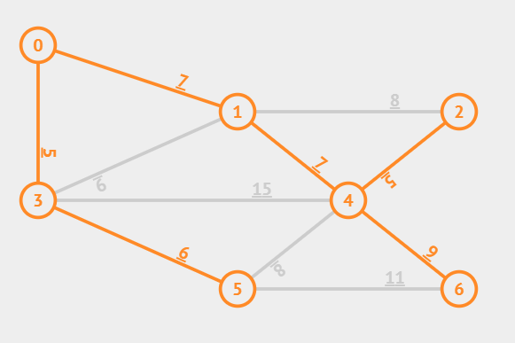

# Algoritmo kruskal

Para executar:

Formato do arquivo que representa que grafo:

Linha 1 - quantidade de vértices
Lina 2..n - relação nó1 - nó2 e custo. Exemplo: Nó 0 conecta com nó 1 e com custo 2: 0 1 2

grafo1.txt

```txt
7
0 1 7
0 3 5
1 2 8
1 3 9
1 4 7
2 4 5
3 4 15
3 5 6
4 5 8
4 6 9
5 6 11
```

> Nós iniciam em zero.



Figura 1: Árvore geradora mínima (arestas ressaltadas) do grafo1.txt

Pseudo código

```pseudo
Sort E edges by increasing weight
T = {}
for (i = 0; i < edgeList.length; i++)
  if adding e = edgelist[i] does not form a cycle
    add e to T
  else ignore e
MST = T
```

Fonte: https://visualgo.net/en/mst

```json
{"vl":{"0":{"x":140,"y":60},"1":{"x":320,"y":120},"2":{"x":520,"y":120},"3":{"x":140,"y":200},"4":{"x":420,"y":200},"5":{"x":320,"y":280},"6":{"x":520,"y":280}},"el":{"0":{"u":0,"v":1,"w":"7"},"1":{"u":0,"v":3,"w":"5"},"2":{"u":1,"v":3,"w":"9"},"3":{"u":1,"v":2,"w":"8"},"4":{"u":1,"v":4,"w":"7"},"5":{"u":2,"v":4,"w":"5"},"6":{"u":4,"v":6,"w":"9"},"7":{"u":4,"v":5,"w":"8"},"8":{"u":5,"v":6,"w":"11"},"9":{"u":3,"v":4,"w":"15"},"10":{"u":3,"v":5,"w":"6"}}}
```

Execução:

```bash
python mst_kruskal.py grafo1.txt
# mst, custo: ([[0, 3, 5], [2, 4, 5], [3, 5, 6], [0, 1, 7], [1, 4, 7], [4, 6, 9]], 39)
```
